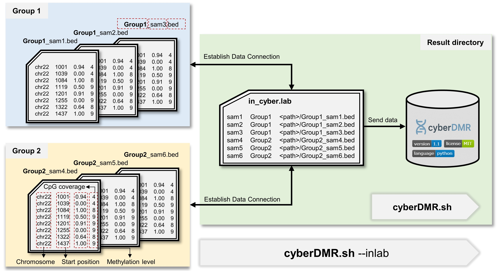

# cyberDMR


[](https://doi.org/10.5281/zenodo.17110291)

**cyberDMR** is a robust and high-sensitivity approach for differentially methylated regions detection.

## Table of Contents

- [1. Introduction](#1-introduction)  
- [2. Installation](#2-installation)
- [3. Usage](#3-usage)
- [4. Arguments](#4-arguments)
- [5. Input Format](#5-input-format)  
    - [Input File Format Requirements](#input-file-format-requirements)  
    - [Lab File Format Requirements](#lab-file-format-requirements)  
- [6. Output Format](#6-output-format)  
- [7. Simulated Data](#7-simulated-data)  
    - [Run](#run)  
    - [Parameter](#parameter)  
- [8. Demo](#8-demo)  
- [9. Release Notes](#9-release-notes)

## 1. Introduction
Differentially methylated regions (DMRs) are key genomic features reflecting changes in DNA methylation status. Accurate identification of DMRs is crucial for investigating tissue-specific regulation, disease mechanisms, and population-level epigenetic variation.

### Features
- Base-level smoothing for low-coverage CpGs
- CpG segmentation based on genomic distance and methylation concordance
- Seed-guided clustering for consistent CpG grouping
- Weighted beta regression with LRT for statistical inference
- Identifiying significant DMRs via BH correction and F-statitics


## 2. Installation
```bash
### Clone the repository
git clone https://github.com/YLeeHIT/cyberDMR.git
cd cyberDMR

### create a new conda environment
conda create -n DM-cyberDMR python=3.12 -y
conda activate DM-cyberDMR

### Install required dependencies
pip install -r requirements.txt
```

---

## 3. Usage

```bash
bash cyberDMR.sh --in-dir <indir> --out-dir <outdir> --group1 <group1> --group2 <group2> [<optional>]
```

Check all available options with:
```bash
bash cyberDMR.sh --help
```

For detailed parameter descriptions, see [4. Arguments](#4-arguments).
For usage examples, [8. Demo](#8-demo)

---

## 4. Arguments

| Parameter               | Required | Description                               | Example                |
|-------------------------|----------|-------------------------------------------|------------------------|
| `-o, --out-dir`         | ✅        | Output directory for storing all results  | `./results/`           |
| `-g1, --group1`         | ✅        | Label of group 1 (e.g., treatment)        | `treatment`            |
| `-g2, --group2`         | ✅        | Label of group 2 (e.g., control)          | `control`              |
| `-i, --in-dir`          | ✅*       | Input files (auto-generate `cyber.lab`)   | `./input/`             |
| `-lab, --cyber-lab`     | ✅*       | Path to an existing `cyber.lab` file      | `./cyber.lab`          |
| `-t, --threads`         | ❌        | Number of worker processes                | `8`                    |
| `-chr, --chroms`        | ❌        | Chromosome set specification              | `chr1,chr2,chr3`       |
| `-d, --delta`           | ❌        | Delta threshold for DMR detection         | `0.1`                  |
| `-bdis, --cpg-distance` | ❌        | Maximum CpG distance for blocking         | `500`                  |
| `-ct, --cpg-count`      | ❌        | Minimum number of CpGs per block          | `5`                    |
| `-cov, --min-cov`       | ❌        | Minimum CpG coverage to retain            | `5`                    |
| `-fdis, --max-dist`     | ❌        | Maximum distance of adjacent CpGs         | `500`                  |
| `-q, --qvalue`          | ❌        | BH-corrected p-value threshold            | `0.05`                 |
| `-f, --Fvalue`          | ❌        | F statistic threshold                     | `15`                   |

\* One of `--in-dir` or `--cyber-lab` must be provided.

### `--out-dir`
Supports both absolute and relative paths.  
This directory will store all output results, including per-chromosome files and the final merged and sorted file `cyberDMR_result.bed`.  

### `--group1`, `--group2`
Names of the two groups must be provided.  
**The experimental group should come first, followed by the control group**, to ensure consistent statistical comparison.  

### `--in-dir`
Supports both absolute and relative paths.  
Should point to the directory containing input files formatted.  
When this parameter is provided, the program will automatically generate an `in_cyber.lab` file. File names must follow strict naming conventions (see [5. Input format](#5-input-format)).  

### `--cyber-lab`
If the user has already prepared a `lab` file that meets the **Input** requirements, it can be provided via this parameter instead of using `--in-dir`.  

### `--threads`
Number of worker processes.  
It is recommended to set this equal to the number of chromosomes for best performance.  

### `--delta`
Minimum methylation difference (Δ).  
DMRs with Δ below this threshold will be filtered out.  

### `--cpg-distance`
Maximum CpG distance for **blocking**.  
This parameter affects the blocking process. Suggested range: `300–1000` (default: `500`).  

### `--cpg-count`
Minimum number of CpGs per DMR block.  
Regions with fewer CpGs will be filtered out.  

### `--min-cov`
Minimum CpG coverage for smoothing:  
- Recommended `5` for WGBS data  
- Recommended `3` for ONT data  
When coverage falls below this threshold, smoothing will be applied.  

### `--max-dist`
Maximum distance between adjacent CpGs for **clustering**.  
This parameter affects the clustering process. Suggested range: `300–1000` (default: `500`).  

### `--qvalue`
Benjamini–Hochberg corrected p-value threshold.  
DMRs with q-values above this cutoff will be filtered out.  

### `--Fvalue`
F-statistic threshold.  
- Strict filtering: `20`  
- Relaxed filtering: `5`  

---

## 5. Input format

<div align="center">
    
</div >

Before running `cyberDMR.sh`, you can provide the directory containing all sample files using the `-i` option. In this case, cyberDMR will automatically generate the `in_cyber.lab` file.  
Alternatively, you can supply your own lab file with sample paths and grouping information using the `-lab` option. cyberDMR will also recognize this file and proceed with the analysis.

### Input File Format Requirements
- Input files should be tab-delimited text (`.tsv` or `.bed`-like format) without a header.  
- Each input file name must include the group label (e.g., `HG002_treatment.tsv`, `HG003_control.tsv`).
- Each file should contain exactly four columns in the following order:

1. **Chromosome** (`string`) – e.g., `chr22`  
2. **CpG position** (`integer`) – genomic coordinate (0-based or 1-based)  
3. **Methylation level** (`float`) – value between `0.0` and `1.0`  
4. **Coverage** (`integer`) – positive integer indicating read depth  

**Example** (`in_cyber.lab`):
```
chr1    107908  1.0     25
chr1    107977  1.0     40
chr1    107988  1.0     20
chr1    108918  0.5301  32
chr1    109368  0.5236  30
chr1    109545  0.675   24
chr1    110009  0.5276  33
chr1    113405  0.2748  32
chr1    113828  0.3616  25
chr1    113945  0.3926  31
```

### Lab File Format Requirements

- This file is used to define the grouping of biological replicates, their phenotypic labels, and the corresponding input files.  
- It must strictly follow the format below (tab-delimited, without a header):

1. **Sample ID** – unique identifier for each biological replicate  
2. **Group label** – e.g., `treatment` or `control` (only **two groups** are supported)  
3. **Absolute file path** – path to the input file (including the group label in the filename)  

**Example** (`in_cyber.lab`):
```
139C    lethal  /absolute/path/to/noh_lethal_139C_auto.bed
1601C   lethal  /absolute/path/to/noh_lethal_1601C_auto.bed
349C    lethal  /absolute/path/to/noh_lethal_349C_auto.bed
379C    lethal  /absolute/path/to/noh_lethal_379C_auto.bed
46C     lethal  /absolute/path/to/noh_lethal_46C_auto.bed
514C    lethal  /absolute/path/to/noh_lethal_514C_auto.bed
564C    lethal  /absolute/path/to/noh_lethal_564C_auto.bed
1601N   normal  /absolute/path/to/noh_normal_1601N_auto.bed
448N    normal  /absolute/path/to/noh_normal_448N_auto.bed
508N    normal  /absolute/path/to/noh_normal_508N_auto.bed
564N    normal  /absolute/path/to/noh_normal_564N_auto.bed
```

---

## 6. Output Format

All results will be written to the specified output directory. The following files are generated:

- `in_cyber.lab` – automatically generated lab file if `--in-dir` is provided  
- `chr*_cyberDMR.txt` – per-chromosome result files  
- `cyberDMR_result.bed` – final merged and sorted result file  

### `cyberDMR_result.bed` format

The file contains **11 tab-delimited columns**:

1. **Chromosome** – chromosome ID (e.g., `chr1`)  
2. **Start** – genomic start position  
3. **End** – genomic end position  
4. **CpG_count** – number of CpGs in the DMR  
5. **Group1_methylation** – average methylation level in group1  
6. **Group2_methylation** – average methylation level in group2  
7. **Delta_methylation** – methylation difference between the two groups  
8. **F_value** – F-statistic value  
9. **p_value** – raw p-value  
10. **q_value** – Benjamini–Hochberg adjusted p-value  
11. **Pass** – whether the region passes both p-value and F-value filters (final output only keeps `True`)  

**Example** (`cyber_result.bed`):
```
chr19   290632  290697  6       0.0681  0.2254  0.1573  31.7828 0.0003481       0.0006503       True
chr19   291682  291986  45      0.2205  0.0291  -0.1914 47.9067 1.252e-26       1.161e-24       True
chr19   294290  295539  65      0.4836  0.0629  -0.4208 33.1036 2.616e-40       6.564e-38       True
chr19   310363  310457  8       0.8646  0.6734  -0.1912 25.7401 0.0001574       0.0003491       True
chr19   310780  310961  8       0.9192  0.7596  -0.1596 46.8572 1.999e-05       6.887e-05       True
chr19   311892  312029  10      0.8006  0.9647  0.1642  21.5986 3.107e-05       9.748e-05       True
chr19   315493  315875  8       0.754   0.9461  0.1922  19.3177 0.000934        0.001422        True
```

---

## 7. Simulated Data

We provide a simulation script `simulate_data.sh` for testing and benchmarking purposes. This script includes **three main functions**:

1. **Generate simulated datasets**  
    - Supports multiple scenarios, including variation in DMR length, CpG density, methylation difference, coverage, and sample size.  
    - Users may also directly call `simulated_data.py` for fine-grained control (see [`data/Simulation.para`](data/Simulation.para) for detailed parameters).  

2. **Prepare tool-specific input formats**  
    - Converts the simulated data into input formats required by six DMR detection tools:  
    - **cyberDMR**, **Metilene**, **HOME**, **BSmooth**, **MethyLasso**, **DiffMethylTools**  

### Run

You can directly use the shell script `simulate_data.sh`.  
The parameter `-o, --output_dir` must be specified, while all other parameters are optional.  
For detailed parameter descriptions (see [Parameter](#parameter)).

```bash
bash simulate_data.sh -o <outdir> [<optional>]
```

Check all available options with:
```bash
bash simulate_data.sh -h
```

Alternatively, you can only generate the simulated data by calling the Python script directly:

```bash
python simulated_data.py \
    --total_dmr 1000 \
    --mean_delta 0.3 \
    --n_control 5 \
    --n_treatment 5 \
    --coverage_mean 30 \
    --coverage_std 5 \
    --output_dir ./out \
    --chr_name chr1 \
    --start_pos 10000 \
    --length_mean 1000 \
    --length_std 300 \
    --max_cpgs 50 \
    --dmr_per 0.3 \
    --dmr_notable_per 0.05 \
    --dmr_inconsis_per 0.1 \
    --dmr_sub_per 0.05 \
    --density auto \
    --dense_ratio 0.5 \
    --seed 42
```

### Parameter


| Parameter | Required | Description | Default |
|-----------|----------|-------------|---------|
| `-o, --output_dir` | ✅ | Output directory | `./output` |
| `-t, --total_dmr` | ❌ | Total number of simulated DMRs | `10000` |
| `-d, --mean_delta` | ❌ | Mean methylation delta | `0.25` |
| `-c, --n_control` | ❌ | Number of control samples | `10` |
| `-e, --n_treatment` | ❌ | Number of treatment samples | `10` |
| `-m, --coverage_mean` | ❌ | Mean coverage depth | `30` |
| `-s, --coverage_std` | ❌ | Coverage standard deviation | `5` |
| `-r, --chr_name` | ❌ | Chromosome name | `chr1` |
| `-p, --start_pos` | ❌ | Start position for DMR simulation | `100000` |
| `-l, --length_mean` | ❌ | Mean DMR length | `1000` |
| `-z, --length_std` | ❌ | Standard deviation of DMR length | `100` |
| `-x, --max_cpgs` | ❌ | Maximum CpGs per DMR | `100` |
| `-q, --dmr_per` | ❌ | Proportion of good DMRs | `0.19` |
| `-n, --dmr_notable_per` | ❌ | Proportion of notable DMRs | `0.01` |
| `-i, --dmr_inconsis_per` | ❌ | Proportion of inconsistent DMRs | `0` |
| `-u, --dmr_sub_per` | ❌ | Proportion of sub DMRs | `0` |
| `-y, --density` | ❌ | Density mode: `mix` / `dense` / `sparse` | `mix` |
| `-a, --dense_ratio` | ❌ | Ratio of dense regions | `0.35 |
| `-S, --seed` | ❌ | Random seed | `42` |
| `-T, --threads` | ❌ | Number of threads for cyberDMR | `1` |
| `-h, --help` | ❌ | Show help message and exit | – |

---

## 8. Demo:

We provide a `demo/` folder containing example input files and expected results.  
Users can quickly test the workflow with the following commands:


```bash
# Run simulated data generation
bash simulate_data.sh -o ../demo/simulate_data -t 100
```

```bash
# Run cyberDMR on the demo input
bash cyberDMR.sh -i ./demo/input -o ./demo/output -g1 lethal -g2 normal -q 0.01
```

## 9. Release Notes

### Release Notes – cyberDMR v1.0

**Release Date:** 2025-05-13
**Status:** Initial release

### Release Notes – cyberDMR v1.1

**Release Date:** 2025-09-12
**Status:** Initial release

- Fixed the "Maximum Likelihood optimization failed" error in certain edge cases during model fitting.
- Added simulated datasets for multiple scenarios to demonstrate tool behavior under different conditions.
- Expanded usage instructions and added demo.

If you use **cyberDMR** in your research, please cite the following paper:

> **Li, Yang**, *et al.*
> **cyberDMR: a robust and high-sensitivity approach for differentially methylated regions detection**
> *Bioinformatics*, 2025 (under review)
> [GitHub Project](https://github.com/YLeeHIT/cyberDMR)

We appreciate your support!

# Contributors

This package is developed and maintaned by [Lee](https://github.com/YLeeHIT) and [Chen](https://github.com/chong-hun). If you want to contribute, please leave an issue or submit a pull request. Thank you.

# License

This project is licensed under the MIT License - see the [LICENSE](LICENSE) file for details.
