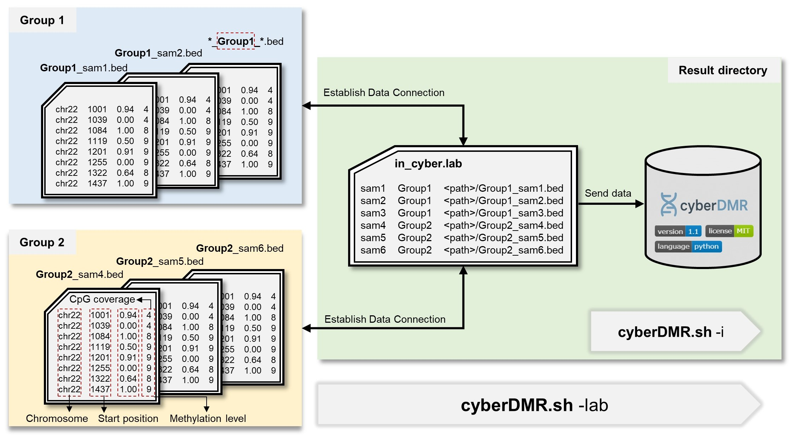

<div align="left">
    
</div >


## Table of Contents

- [1. Introduction](#1-introduction)  
- [2. Installation](#2-installation)
- [3. Usage](#3-usage)
- [4. Arguments](#4-arguments)
- [5. Input Format](#5-input-format)  
    - [Input File Format Requirements](#input-file-format-requirements)  
    - [Lab File Format Requirements](#lab-file-format-requirements)  
- [6. Output Format](#6-output-format)  
- [7. Simulated Data](#7-simulated-data)  
    - [Run](#run)  
    - [Parameter](#parameter)  
- [8. Demo](#8-demo)  
- [9. Release Notes](#9-release-notes)

## 1. Introduction
- **cyberDMR** is an accurate and robust approach for differentially methylated regions (DMRs) detection.
- **cyberDMR** is applicable to second-generation methylation sequencing data (e.g., WGBS, RRBS, and other targeted methylation sequencing approaches) and third-generation platforms (e.g., ONT and PacBio), whereas array-based data (e.g., 450K or EPIC) need to be converted into the standard cyberDMR input format by the user.
- **cyberDMR** has been systematically tested on the human genome and shows stable performance. Its use on other species is not recommended at this stage, as it has not yet been thoroughly validated.
### Features

#### Weighted smoothing for low-coverage CpGs
cyberDMR applies a distance-aware weighted smoothing strategy that integrates methylation signals from neighboring CpGs, improving methylation estimation accuracy in low-coverage and CpG-sparse genomic regions.

#### Seed-guided clustering for precise DMR boundary detection
By initiating from CpG sites with maximal methylation differences (ΔM) and extending only through consistently differential sites, cyberDMR constructs coherent DMR blocks and achieves accurate boundary delineation.

#### Noise-resilient statistical framework
cyberDMR combines an F-like statistic with weighted beta regression and likelihood-ratio testing to suppress intra-group methylation variability and robustly identify biologically consistent DMRs.


## 2. Installation
```bash
### Clone the repository
git clone https://github.com/YLeeHIT/cyberDMR.git
cd cyberDMR

### create a new conda environment
conda create -n DM-cyberDMR python=3.12 -y
conda activate DM-cyberDMR

### Install required dependencies
pip install -r requirements.txt
```

---

## 3. Usage

```bash
### Run with input file path
python cyberDMR.py -i <PATH> -o <PATH> -g1 <STR> -g2 <STR> [<optional>]

### Run with a file that contains input file paths
python cyberDMR.py -lab <PATH> -o <PATH> -g1 <group1> -g2 <group2> [<optional>]
```

Check all available options with:
```bash
python cyberDMR.py --help
```

For detailed parameter descriptions, see [4. Arguments](#4-arguments).
For usage examples, [8. Demo](#8-demo)

---

## 4. Arguments

| Parameter               | Required | Description                               | Example                |
|-------------------------|----------|-------------------------------------------|------------------------|
| `-o, --out-dir`         | ✅        | Output directory for storing all results  | `./results/`           |
| `-g1, --group1`         | ✅        | Label of group 1 (e.g., treatment)        | `treatment`            |
| `-g2, --group2`         | ✅        | Label of group 2 (e.g., control)          | `control`              |
| `-i, --in-dir`          | ✅*       | Input files (auto-generate `cyber.lab`)   | `./input/`             |
| `-lab, --cyber-lab`     | ✅*       | Path to an existing `cyber.lab` file      | `./in_cyber.lab`          |
| `-t, --threads`         | ❌        | Number of worker processes                | `8`                    |
| `-chr, --chroms`        | ❌        | Chromosome set specification              | `chr1,chr2,chr3`       |
| `-d, --delta`           | ❌        | Delta threshold for DMR detection         | `0.1`                  |
| `-bdis, --cpg-distance` | ❌        | Maximum CpG distance for blocking         | `500`                  |
| `-ct, --cpg-count`      | ❌        | Minimum number of CpGs per block          | `5`                    |
| `-cov, --min-cov`       | ❌        | Minimum CpG coverage to retain            | `5`                    |
| `-fdis, --max-dist`     | ❌        | Maximum distance of adjacent CpGs         | `500`                  |
| `-q, --qvalue`          | ❌        | BH-corrected p-value threshold            | `0.05`                 |
| `-f, --Fvalue`          | ❌        | F statistic threshold                     | `150`                   |

\* One of `--in-dir` or `--cyber-lab` must be provided.

### `--out-dir`
Supports both absolute and relative paths.  
This directory will store all output results, including per-chromosome files and the final merged and sorted file `cyberDMR_result.bed` (see [Output format](#6-output-format)).  

### `--group1`, `--group2`
Names of the two groups must be provided.  
**The experimental group should come first, followed by the control group**, to ensure consistent statistical comparison.  

### `--in-dir`
Supports both absolute and relative paths.  
Should point to the directory containing input files formatted.  
When this parameter is provided, the program will automatically generate an `in_cyber.lab` file. File names must follow strict naming conventions (see [Input File Format Requirements](#input-file-format-requirements)).  

### `--cyber-lab`
If the user has already prepared a `lab` file that meets the **Input** requirements (see [Lab File Format Requirements](#lab-file-format-requirements)), it can be provided via this parameter instead of using `--in-dir`.  

### `--threads`
Number of worker processes.  
It is recommended to set this equal to the number of chromosomes for best performance.  

### `--delta`
Minimum methylation difference (ΔM).  
DMRs with Δ below this threshold will be filtered out.  

### `--cpg-distance`
Maximum CpG distance for **blocking**.  
This parameter affects the blocking process. Suggested range: `300–1000` (default: `500`).  

### `--cpg-count`
Minimum number of CpGs per DMR block.  
Regions with fewer CpGs will be filtered out.  

### `--min-cov`
Minimum CpG coverage for smoothing:  
- Recommended `5` for WGBS data  
- Recommended `3` for ONT data  
When coverage falls below this threshold, smoothing will be applied.  

### `--max-dist`
Maximum distance between adjacent CpGs for **clustering**.  
This parameter affects the clustering process. Suggested range: `300–1000` (default: `500`).  

### `--qvalue`
Benjamini–Hochberg corrected p-value threshold (default: `0.05`).  
DMRs with q-values above this cutoff will be filtered out.  

### `--Fvalue`
F-statistic threshold (default: ``150``). 
`100–150` for single-sample analyses; 
`150–500` for multi-sample analyses.  

---

## 5. Input format

<div align="center">
    
</div >

Before running `cyberDMR.sh`, you can provide the directory containing all sample files using the `-i` option. In this case, cyberDMR will automatically generate the `in_cyber.lab` file.  
Alternatively, you can supply your own lab file with sample paths and grouping information using the `-lab` option. cyberDMR will also recognize this file and proceed with the analysis.

### Input File Format Requirements
- Input files should be tab-delimited text (`.tsv` or `.bed`-like format) without a header.  
- Each input file name must include the group label (e.g., `HG002_treatment.tsv`, `HG003_control.tsv`).
- Each file should contain exactly four columns in the following order:

1. **Chromosome** (`string`) – e.g., `chr22`  
2. **CpG position** (`integer`) – genomic coordinate (0-based or 1-based)  
3. **Methylation level** (`float`) – value between `0.0` and `1.0`  
4. **Coverage** (`integer`) – positive integer indicating read depth  

**Example** (`in_cyber.lab`):
```
chr1    107908  1.0     25
chr1    107977  1.0     40
chr1    107988  1.0     20
chr1    108918  0.5301  32
chr1    109368  0.5236  30
chr1    109545  0.675   24
chr1    110009  0.5276  33
chr1    113405  0.2748  32
chr1    113828  0.3616  25
chr1    113945  0.3926  31
```

### Lab File Format Requirements

- This file is used to define the grouping of biological replicates, their phenotypic labels, and the corresponding input files.  
- It must strictly follow the format below (tab-delimited, without a header):

1. **Sample ID** – unique identifier for each biological replicate  
2. **Group label** – e.g., `treatment` or `control` (only **two groups** are supported)  
3. **Absolute file path** – path to the input file (including the group label in the filename)  

**Example** (`in_cyber.lab`):
```
139C    lethal  /absolute/path/to/noh_lethal_139C_auto.bed
1601C   lethal  /absolute/path/to/noh_lethal_1601C_auto.bed
349C    lethal  /absolute/path/to/noh_lethal_349C_auto.bed
379C    lethal  /absolute/path/to/noh_lethal_379C_auto.bed
46C     lethal  /absolute/path/to/noh_lethal_46C_auto.bed
514C    lethal  /absolute/path/to/noh_lethal_514C_auto.bed
564C    lethal  /absolute/path/to/noh_lethal_564C_auto.bed
1601N   normal  /absolute/path/to/noh_normal_1601N_auto.bed
448N    normal  /absolute/path/to/noh_normal_448N_auto.bed
508N    normal  /absolute/path/to/noh_normal_508N_auto.bed
564N    normal  /absolute/path/to/noh_normal_564N_auto.bed
```

---

## 6. Output Format

All results will be written to the specified output directory. The following files are generated:

- `in_cyber.lab` – automatically generated lab file if `--in-dir` is provided  
- `chr*_cyberDMR.txt` – per-chromosome result files  
- `cyberDMR_result.bed` – final merged and sorted result file  

### `cyberDMR_result.bed` format

The file contains **11 tab-delimited columns**:

1. **Chromosome** – chromosome ID (e.g., `chr1`)  
2. **Start** – genomic start position  
3. **End** – genomic end position  
4. **CpG_count** – number of CpGs in the DMR  
5. **Group1_methylation** – average methylation level in group1  
6. **Group2_methylation** – average methylation level in group2  
7. **Delta_methylation** – methylation difference between the two groups  
8. **F_value** – F-statistic value  
9. **p_value** – raw p-value  
10. **q_value** – Benjamini–Hochberg adjusted p-value  
11. **high_var_pro** – Proportion of CpG sites exhibiting high within-group variability 

**Example** (`cyber_result.bed`):
```
chr1    180998  181199  27      0.7526  0.9211  -0.1685 429.7448        2.893e-09       2.587e-08       0.4815
chr1    181207  181286  17      0.8519  0.964   -0.1121 3297.0741       3.345e-07       1.695e-06       0.0
chr1    195905  196498  5       0.799   0.3047  0.4943  166.8253        0.0006944       0.001407        0.0
chr1    605057  605929  43      0.6778  0.3416  0.3361  235.6434        1.428e-12       1.973e-11       0.3721
chr1    1700493 1700990 41      0.814   0.9558  -0.1418 167.7613        4.684e-14       7.911e-13       0.0244
```

---

## 7. Simulated Data

We provide a simulation script `simulated_data.py` for testing and benchmarking purposes.  
This script generates simulated DMR datasets under diverse scenarios, including variations in DMR length, CpG density, methylation difference, sequencing coverage, and sample size.  

### Run

You can only generate the simulated data by calling the Python script `simulated_data.py` directly:
The parameter `-o, --output_dir` must be specified, while all other parameters are optional.  
For detailed parameter descriptions (see [Parameter](#parameter)).


### Example

Basic command:
```bash
bash simulated_data.py -o <outdir> [<optional>]
```

Check all available options with:
```bash
bash simulated_data.py -h
```

Commonly used parameters (default values are recommended unless otherwise specified):
```bash
python simulated_data.py \
    --total_dmr 1000 \
    --mean_delta 0.3 \
    --n_control 5 \
    --n_treatment 5 \
    --coverage_mean 30 \
    --coverage_std 5 \
    --output_dir ./out \
    --chr_name chr1 \
    --start_pos 10000 \
    --length_mean 1000 \
    --length_std 300 \
    --max_cpgs 50 \
    --dmr_per 0.3 \
    --dmr_notable_per 0.05 \
    --dmr_inconsis_per 0.1 \
    --dmr_sub_per 0.05 \
    --density auto \
    --dense_ratio 0.5 \
    --seed 42
```

### Parameter

| Parameter                 | Required | Description                                        | Default    |
| ------------------------- | -------- | -------------------------------------------------- | ---------- |
| `-o, --output_dir`        | ✅        | Output directory for simulation results            | `./out`    |
| `-t, --total_dmr`         | ❌        | Total number of simulated regions                  | `100`      |
| `-d, --mean_delta`        | ❌        | Target mean methylation difference (± allowed)     | `0.3`      |
| `-c, --n_control`         | ❌        | Number of control samples                          | `5`        |
| `-e, --n_treatment`       | ❌        | Number of treatment samples                        | `5`        |
| `-m, --coverage_mean`     | ❌        | Mean sequencing coverage per CpG                   | `30`       |
| `-s, --coverage_std`      | ❌        | Standard deviation of CpG coverage                 | `5`        |
| `-r, --chr_name`          | ❌        | Chromosome name                                    | `chr1`     |
| `-p, --start_pos`         | ❌        | Start genomic coordinate for simulation            | `10000`    |
| `-l, --length_mean`       | ❌        | Mean DMR length (bp)                               | `1000`     |
| `-z, --length_std`        | ❌        | Standard deviation of DMR length (bp)              | `100`      |
| `-x, --max_cpgs`          | ❌        | Maximum number of CpGs per region (hard cap)       | `500`      |
| `-y, --density`           | ❌        | CpG density mode: `dense` / `moderate` / `sparse`  | `moderate` |
| `-q, --dmr_per`           | ❌        | Proportion of good-DMR regions                     | `0.25`     |
| `-n, --dmr_notable_per`   | ❌        | Proportion of notable-DMR regions                  | `0.02`      |
| `-i, --dmr_inconsis_per`  | ❌        | Proportion of inconsistent-DMR regions             | `0.03`      |
| `-u, --dmr_sub_per`       | ❌        | Proportion of sub-DMR regions                      | `0.05`      |
| `-cm, --dmr_missing_max`  | ❌        | Maximum CpG-level missing rate within a DMR        | `0.1`      |
| `-sm,--sample_missing_max`| ❌        | Maximum sample-level missing rate within a group   | `0.1`      |
| `-nd,--no_delta_methylation`| ❌        | Mean methylation difference for non-DMR regions    | `0.08`     |
| `-mn, --min_gap`          | ❌        | Minimum inter-region gap along the chromosome (bp) | `10`       |
| `-mx, --max_gap`          | ❌        | Maximum inter-region gap along the chromosome (bp) | `50`       |
| `-S, --seed`              | ❌        | Random seed for reproducibility                    | `42`       |
| `-h, --help`              | ❌        | Show help message and exit                         | –          |

**Note**: Parameters not listed above are considered advanced/internal and generally do not require adjustment for typical simulation use cases.

---

## 8. Demo:

We provide a `demo/` folder containing example input files and expected results.  
Users can quickly test the workflow using the script `script/run_simulation_cyberDMR.sh`.  
Please specify the path to the cyberDMR root directory so that all required scripts can be correctly located.  
The basic command is shown below:

### View help
```bash
bash run_simulation_cyberDMR.sh -h
```

### Basic usage example
```bash
bash script/run_simulation_cyberDMR.sh -root $(pwd) -o ./demo
```


## 9. Release Notes
### Release Notes - cyberDMR v1.2
**Release Date:** 2025-12-17
**Status:** Feature update
- Refactored the cyberDMR codebase into a unified and streamlined framework.
- Integrated population-level (pDMR) and haplotype-resolved (hDMR) detection results derived from ONT long-read methylation datasets.

**Update Date:** 2026-02-20
- Added an extended description of the applicability of **cyberDMR**, clarifying its compatibility with multiple methylation sequencing platforms (including WGBS, RRBS, targeted methylation sequencing, and long-read ONT/PacBio data).
- Incorporated benchmarking results comparing **cyberDMR** with **DSS**, including accuracy metrics and computational performance evaluation.

### Release Notes – cyberDMR v1.1
**Release Date:** 2025-09-12
**Status:** Feature update
- Fixed the "Maximum Likelihood optimization failed" error in certain edge cases during model fitting.
- Added simulated datasets for multiple scenarios to demonstrate tool behavior under different conditions.
- Expanded usage instructions and added demo.

### Release Notes – cyberDMR v1.0
**Release Date:** 2025-05-13
**Status:** Initial release

If you use **cyberDMR** in your research, please cite the following paper:
> **Li, Yang**, *et al.*
> **cyberDMR: accurate and robust identification of differentially methylated regions from WGS-derived methylomes**
> *BMC Biology*, 2025 (under review)
> [GitHub Project](https://github.com/YLeeHIT/cyberDMR)

We appreciate your support!

# Contributors

This package is developed and maintaned by [Lee](https://github.com/YLeeHIT) and [Chen](https://github.com/chong-hun). If you want to contribute, please leave an issue or submit a pull request. Thank you.

# License

This project is licensed under the MIT License - see the [LICENSE](LICENSE) file for details.
